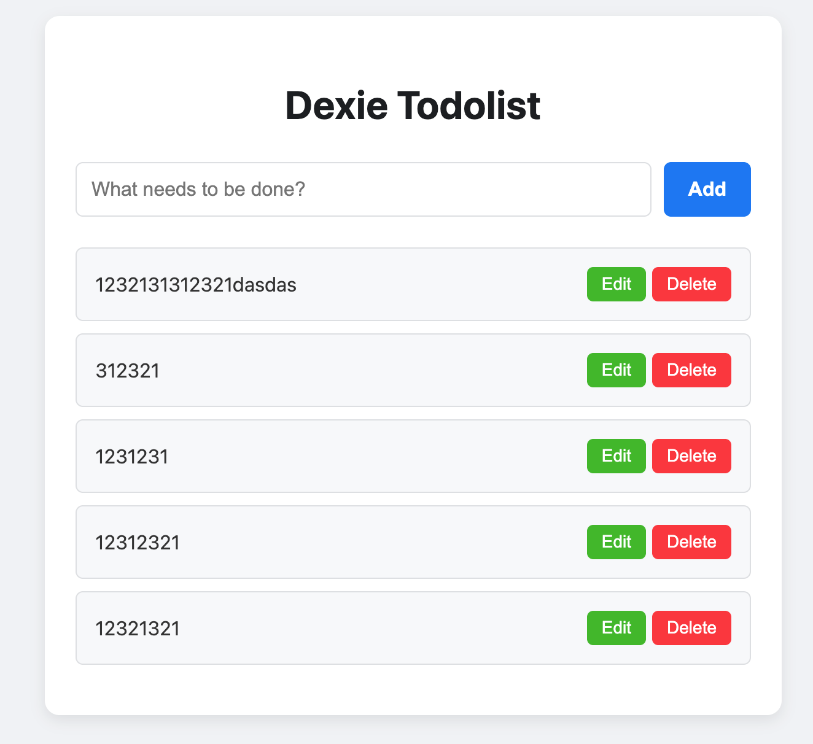
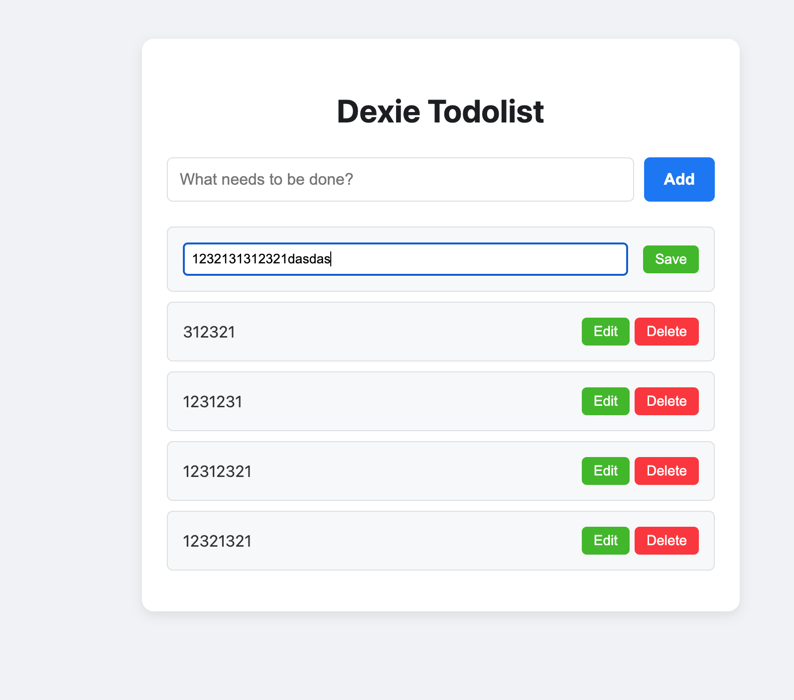
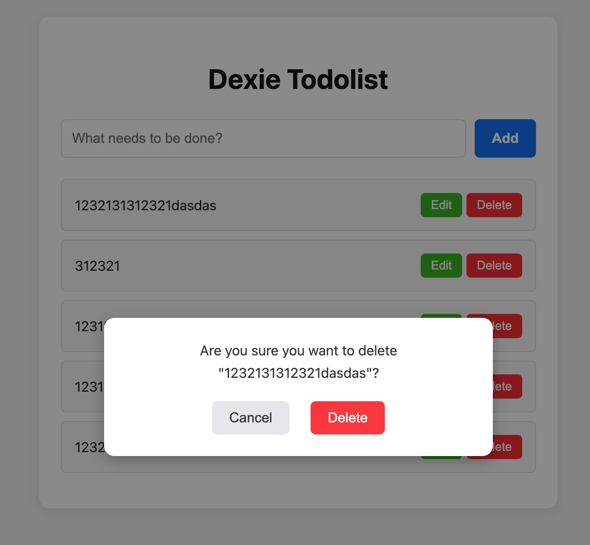

# IndexDB-Todolist

Try to implement a todolist program using indexdb for learning indexdb api.
There are two verison of it:

- native indexdb api version
- [rxdb](https://github.com/pubkey/rxdb) version

So let's do that!

> home:

> edit

> delete

